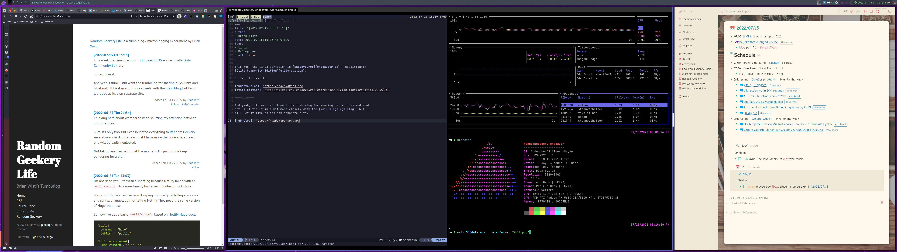

This week the Linux partition is [EndeavourOS](https://endeavouros.com) — specifically
[Qtile Community Edition](https://discovery.endeavouros.com/window-tiling-managers/qtile/2022/01/).

<!--more-->

you have to add a few things to make tiling window manager screenshots interesting

So far, I like it.

And yeah, I think I still want the tumblelog for sharing quick links and what not. I'll tie it in a bit more closely with the main blog, but I will let it live as its own separate site.
