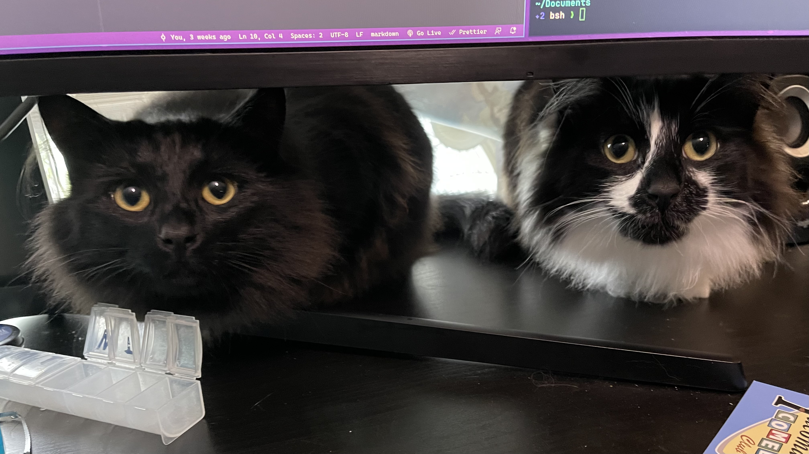

Cats haven't checked in on me for a bit. It's nice. A bit creepy, but nice.


Okay human, now do something interesting.

<!--more-->

Oh and for a little bit of [Nushell](https://nushell.sh) geekery, here's how I copied the newest photo from Dropbox sync to the folder for this post — since neither are named in a readily accessible pattern for quick typing:

````nushell
cp (ls ~/Dropbox/Camera | last | get name) $"(ls content/posts/2022/07/ | last | get name)/cats.jpg"
````
