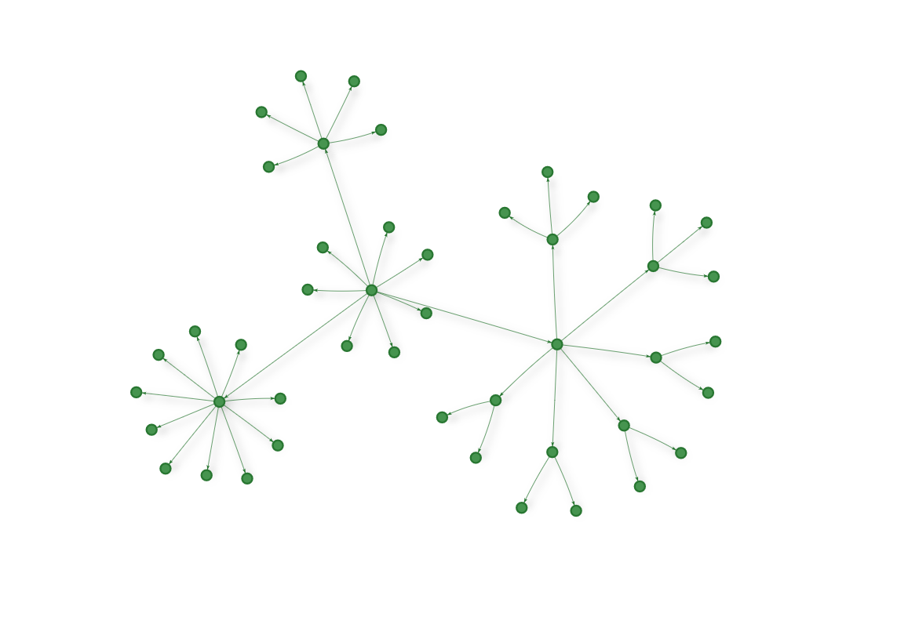
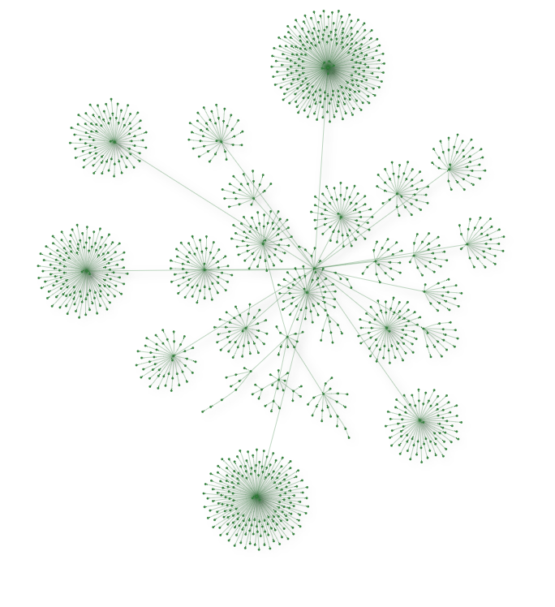

Used [CogDB](https://cogdb.io) to describe a folder hierarchy. Easier than figuring out how to annotate recursive structures for [Mypy](http://mypy-lang.org).

I got some weird ideas of hard vs easy.


No labels or code because it's work(ish)

<!--more-->

Okay *fine*. Here's a cleaned-up version of the code looking at the [Random Geekery](../../../card/Random%20Geekery.md) Markdown sources.

````python
from dataclasses import dataclass, field
from pathlib import Path
from typing import Dict, Set

from cog.torque import Graph


@dataclass
class Folder:
    root: Path
    pattern: str
    graph: Graph = field(init=False)
    files: Dict[str, str] = field(init=False)
    graph_paths: Set[str] = field(init=False, default_factory=set)

    def __post_init__(self):
        self.graph = Graph("files")
        self.__load_files()

    def __load_files(self):
        self.files = {}

        for path in self.root.glob(self.pattern):
            self.load_path(path)

    def graph_path_for(self, path: Path) -> str:
        # some funkiness because this started on windows
        return "/".join(path.relative_to(self.root).parts)

    def load_path(self, path: Path):
        graph_path = self.graph_path_for(path)
        self.files[graph_path] = "FILLER"
        self.graph_paths.add(graph_path)
        self.place_graph_path(path)

    def place_graph_path(self, path: Path):
        if path == self.root:
            return

        parent = path.parent
        graph_child = self.graph_path_for(path)
        graph_parent = self.graph_path_for(parent)
        self.graph_paths.add(graph_parent)
        self.graph.put(graph_parent, "parent", graph_child)
        self.place_graph_path(parent)


if __name__ == "__main__":
    root = Path("~/Sites/rgb-hugo").expanduser()
    folder = Folder(root, "**/*.md")
    url = folder.graph.v().tag("from").out("parent").tag("to").view("parent").url
    print(url)
````


that image took a lot longer to render

Aside from the pretty picture, the nested structure that is now a graph helps me pull some files into [Logseq](../../../card/Logseq.md) for better notes.

ooh i could pull my site into logseq

Go to bed, Brian.
