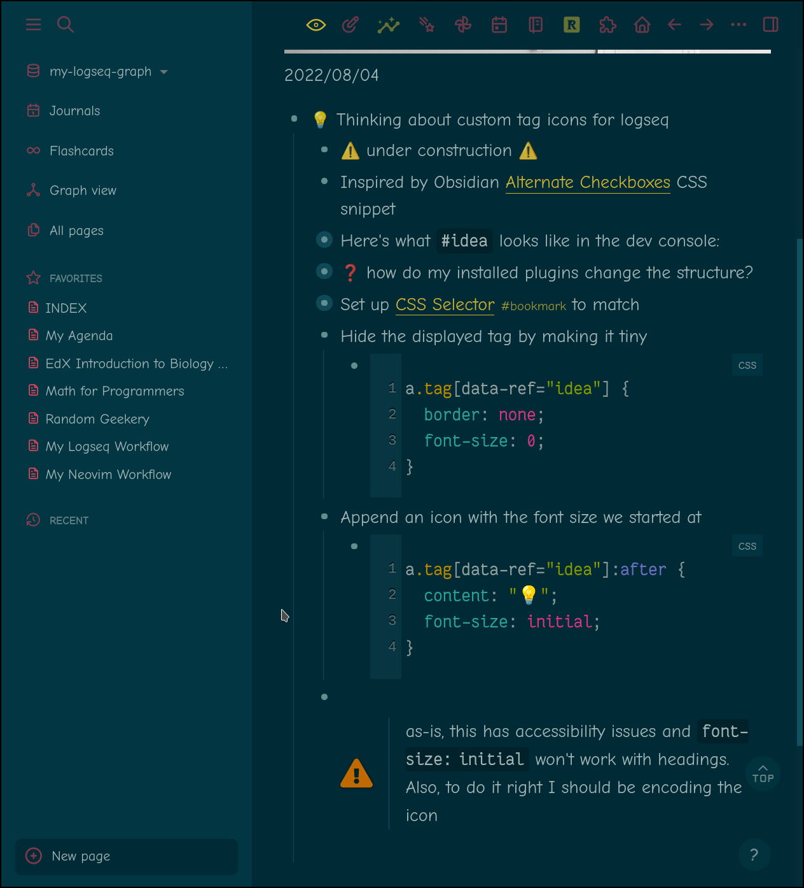

I tried visually replacing a few [card/Logseq](../../../card/Logseq.md) tags with icons in CSS. It worked!


Three down, a few thousand to go

<!--more-->

How'd I do it? Here I'll just paste from my journal note figuring out the first one. I'm sure I'll revisit this tonight after taking care of the day's business.

* \#idea Thinking about custom tag icons for logseq
  * \#warning under construction #warning
  * Inspired by Obsidian [Alternate Checkboxes](https://publish.obsidian.md/hub/02+-+Community+Expansions/02.05+All+Community+Expansions/CSS+Snippets/Alternate+Checkboxes+(SlRvb)) CSS snippet
  * Here's what `#idea` looks like in the dev console:

````html
<div
   class=""
   style="display: inline;"
   data-tooltipped=""
   aria-describedby="tippy-tooltip-119"
   data-original-title="null"
   ><a
	   data-ref="idea"
	   class="tag">#idea</a></div>
````

* \#question how do my installed plugins change the structure?
  * I don't think I currently have any plugins that alter element attributes
* Set up [CSS Selector](https://developer.mozilla.org/en-US/docs/Web/CSS/CSS_Selectors) #bookmark to match
  * `a.tag[data-ref="idea"]`
* Hide the displayed tag by making it tiny

````css
a.tag[data-ref="idea"] {
	border: none;
	font-size: 0;
}
````

* Append an icon with the font size we started at

````css
a.tag[data-ref="idea"]:after {
	content: "💡";
	font-size: initial;
}
````

* as-is, this has accessibility issues and `font-size: initial` won't work with headings. Also, to do it right I should be encoding the icon
