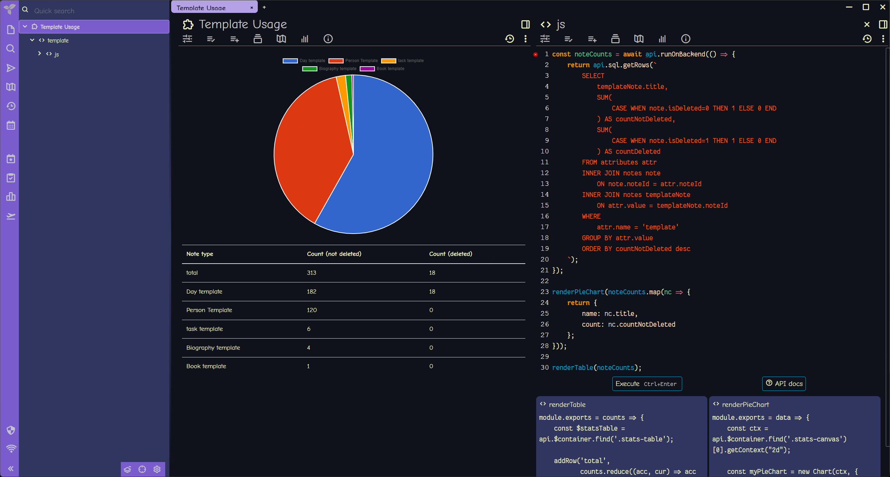

Trilium also embeds its scripting as notes, which takes some getting used to.

Been exploring [Trilium](https://github.com/zadam/trilium) for notes. One thing I'll say is the nerdy features are directly accessible to my existing skills.

<!--more-->

See, each note system has some way — or a plugin providing some way — to query information about your collected notes. Logseq [uses](https://docs.logseq.com/#/page/advanced%20queries) Datascript, which is uh Lisp-ish? Obsidian — if you add the [Dataview](https://blacksmithgu.github.io/obsidian-dataview/) plugin — has DQL, which is SQL-ish.

Trilium keeps everything in a [SQLite](https://sqlite.org) database that you can query directly.


My immediate reaction on realizing what I was seeing? Look I don't usually communicate on this site via memes and image captions, but:


I know the gist of SQL. Let's play with this.

Made a custom [template](https://github.com/zadam/trilium/wiki/Template) for notes about people. Assigned that template to the appropriate notes. Got curious about how my template-using notes were spread out.

Copied the query from *Trilium Demo / Statistics / Note type count* and tweaked it a little for my needs.

````sql
SELECT
    templateNote.title,
    SUM(
        CASE WHEN note.isDeleted=0 THEN 1 ELSE 0 END
    ) AS countNotDeleted,
    SUM(
        CASE WHEN note.isDeleted=1 THEN 1 ELSE 0 END
    ) AS countDeleted
FROM attributes attr
INNER JOIN notes note
    ON note.noteId = attr.noteId
INNER JOIN notes templateNote
    ON attr.value = templateNote.noteId
WHERE
    attr.name = 'template'
GROUP BY attr.value
ORDER BY countNotDeleted desc
````

|title|countNotDeleted|countDeleted|
|-----|---------------|------------|
|Day template|182|18|
|Person Template|120|0|
|task template|6|0|
|Biography template|4|0|
|Book template|1|0|

 > 
 > **NOTE**
>
 > I renamed the Trilium demo's included *People template* to *Biography template*
 > for clarity here.

I duplicated *Note type count*, pasted my new query, then adjusted the layout JS to reflect the tweaked query.

The result:


The demo graph uses [Chart.js](https://www.chartjs.org), which is fine. I'm already thinking about using [Vega](https://vega.github.io) instead.

One thing at a time.

Trilium. It's got SQL. I like that.