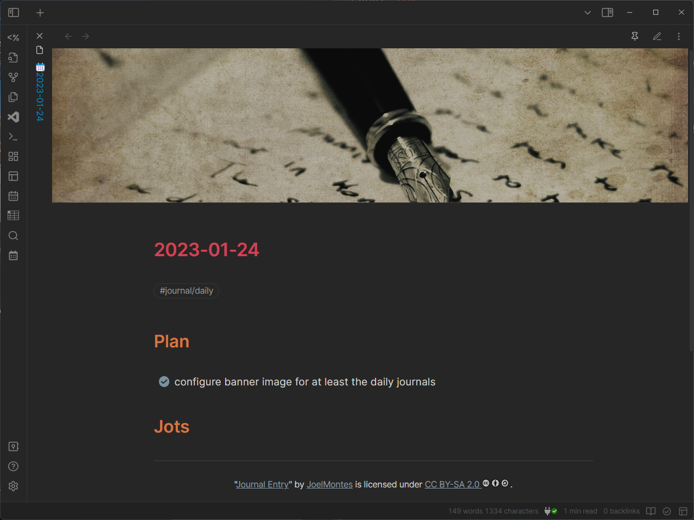
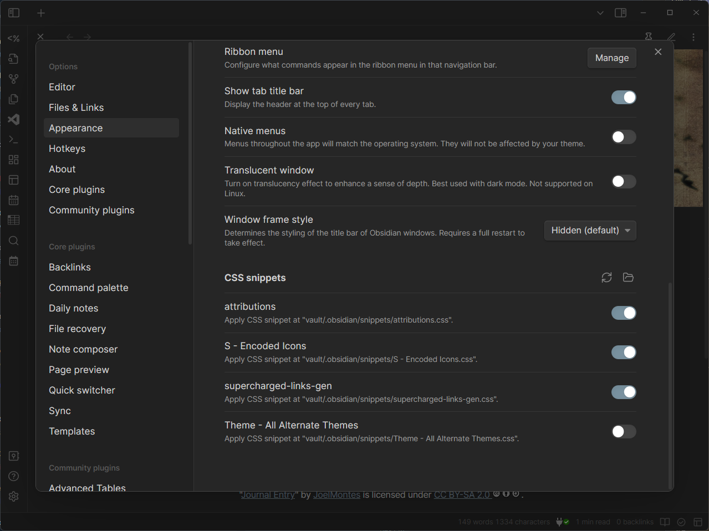

Reader view so you don't have to stare at YAML frontmatter

I added a banner to my [Obsidian](../../../card/Obsidian.md) daily journal template with the [Banners plugin](https://github.com/noatpad/obsidian-banners). I used a Creative Commons image from [Openverse](https://wordpress.org/openverse/), and I wanted to include attribution.

My daily journal template is a small mess of Markdown, HTML, and Templater directives, but it gets the job done.

````md
---
title: <% tp.file.title %>
created_at: <% tp.file.creation_date("YYYY-MM-DDTHH:mm:ssZ") %>
banner: "/assets/journal-entry-joel-montes-de-oca.jpg"
---

# <% tp.file.title %>

#journal/daily

## Plan

## Jots

----

<p class="attribution">
    "<a
        target="_blank"
        rel="noopener noreferrer"
        href="https://www.flickr.com/photos/99887995@N00/4762384399"
        >Journal Entry</a>"
    by
    <a
        target="_blank"
        rel="noopener noreferrer"
        href="https://www.flickr.com/photos/99887995@N00"
        >JoelMontes</a>
    is licensed under
    <a
        target="_blank"
        rel="noopener noreferrer"
        href="https://creativecommons.org/licenses/by-sa/2.0/?ref=openverse"
        >CC BY-SA 2.0
            </a>.
</p>
````

It should have its own style. A little smaller than the note text, and maybe centered for an aesthetic touch. After spending a little too long looking for some kind of theme or plugin magic, I realized Obsidian supports [custom CSS snippets](https://publish.obsidian.md/hub/04+-+Guides%2C+Workflows%2C+%26+Courses/Guides/How+to+Style+Obsidian#Where+do+I+put+my+stylin'+declarations).

So I added `.obsidian/snippets/attributions.css` for attribution paragraphs.

````css
.attribution {
    font-size: 0.8em;
    text-align: center;
}
````

Needed to explicitly enable it under *Settings → Appearance → CSS Snippets*.


Obsidian CSS snippets settings with attributions enabled

Managing Obsidian CSS is a nice little feature. And it's got *just* enough steps that adding a note here for later seemed like a good idea.

And yes I do keep my notes in every tool like some kind of brain squirrel. Someday maybe I'll show you the meta-system I use to keep it all organized.

Maybe after I fix it.
