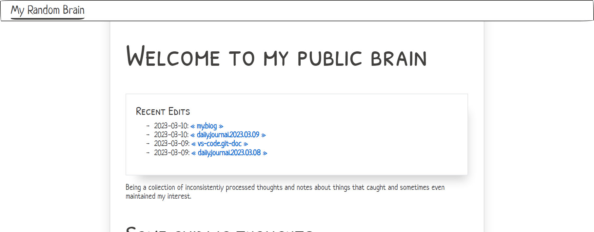

I did just enough to have something I could publish

 > 
 > **2024-01-12**
>
 > It's no longer a separate site, so whatever kind of brain I'm willing to show the world is right here.

Decided to start putting my raw notes online. Okay not *raw* raw. Still gonna be some filtering for content. But ye gods it is raw in the sense of being very rough.

I set up a new [Dendron](https://dendron.so) vault, used [Astro](../../../card/Astro.md) to build a site from it, and [Netlify](https://netlify.com) to host the site. Netlify is synced up to the repo. Since [GitDoc](https://marketplace.visualstudio.com/items?itemName=vsls-contrib.gitdoc) is enabled to commit and push every minute, my brain should stay fresh with minimal effort on my part.

That seems like a good thing, generally.