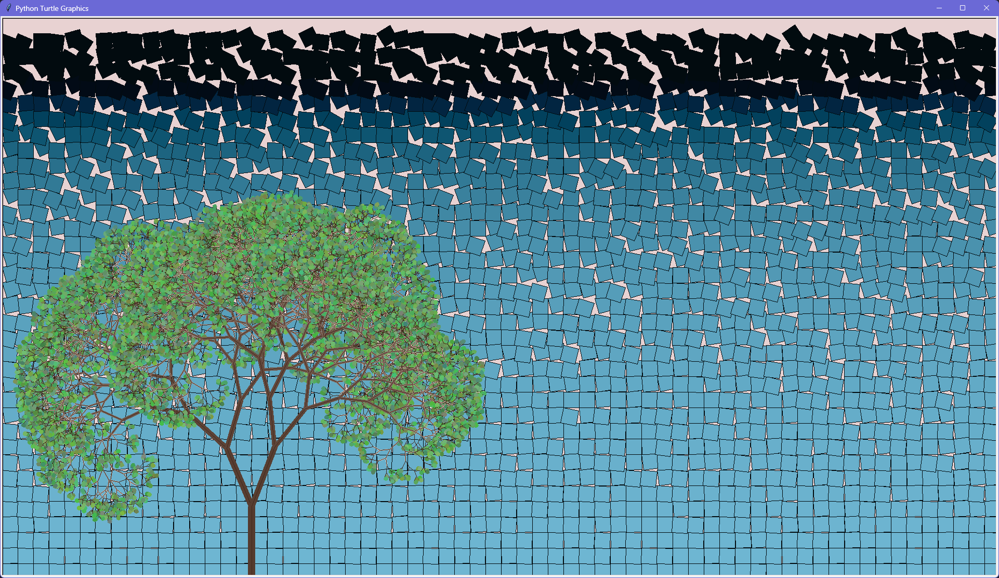

I went a bit past the videos

Got a little bored of trying to build relevant skills for my ongoing job search.
Went through Coding Cassowary's [Generative Art playlist](https://www.youtube.com/playlist?list=PLBLV84VG7Md9oO4MUOhyqz7gBFOzx8XIw) yesterday instead. Had some ideas and fiddled a bit more with those ideas today. Trees should have leaves usually, right?

I'll share the code, but only if you promise to remember this is my brain adding unsorted thoughts to code from the aforementioned playlist. Most of the thoughts in here are unfinished. What I *want* is for you to watch the playlist.
And have some fun drawing with [Python](../../../card/Python.md), using [Turtle](https://docs.python.org/3/library/turtle.html) or some other library.

````python
"""Draw a fractal tree."""

import random
from turtle import Screen, Turtle, _Screen
from typing import Optional, Tuple

RGBColor = Tuple[float, float, float]

COLOR_CANVAS_DEFAULT: RGBColor = (232 / 255, 210 / 255, 210 / 255)
COLOR_PEN_DEFAULT: RGBColor = (94 / 255, 71 / 255, 69 / 255)
COLOR_SKY_LIGHT: RGBColor = (0.53, 0.81, 0.92)
COLOR_SKY_DARK: RGBColor = (0.008, 0.043, 0.059)
COLOR_TRUNK_BASE: RGBColor = (0.26, 0.16, 0.11)
COLOR_TRUNK_LIGHT: RGBColor = (0.96, 0.86, 0.81)


def set_theme(
    screen: _Screen,
    turtle: Turtle,
    canvas_width=1000,
    canvas_height=1000,
    canvas_color=COLOR_CANVAS_DEFAULT,
    pen_color=COLOR_PEN_DEFAULT,
    thickness=1,
    speed_value=0,
    tracer_value=0,
    hide_turtle=True,
):
    """Set properties for the current drawing."""
    screen.setup(canvas_width, canvas_height)
    screen.bgcolor(canvas_color)
    turtle.color(pen_color)
    turtle.width(thickness)
    turtle.speed(speed_value)
    screen.tracer(tracer_value)

    if hide_turtle:
        turtle.hideturtle()


def draw_leaf(turtle: Turtle):
    """Draw a single leaf."""
    leaf_color = (
        random.uniform(0.25, 0.5),
        random.uniform(0.5, 0.75),
        random.uniform(0.25, 0.5),
    )
    turtle.color(leaf_color)
    turtle.begin_fill()
    turtle.circle(4.0)
    turtle.end_fill()
    turtle.color(COLOR_TRUNK_BASE)


def grow(turtle: Turtle, length, decrease, angle, noise=0):
    """Draw a single tree segment."""
    if length <= 8:
        draw_leaf(turtle)
        return

    length_factor = length / 10
    trunk_color = lighten_trunk(length_factor)

    turtle.color(trunk_color)
    turtle.width(length_factor)
    turtle.forward(length)
    new_length = length * decrease

    if noise > 0:
        new_length *= random.uniform(0.9, 1.1)

    angle_l = angle + random.gauss(0, noise)
    angle_r = angle + random.gauss(0, noise)
    turtle.left(angle_l)
    grow(turtle, new_length, decrease, angle, noise)
    turtle.right(angle_l)
    turtle.right(angle_r)
    grow(turtle, new_length, decrease, angle, noise)
    turtle.left(angle_r)
    turtle.backward(length)


def fit_color(
    rgb: RGBColor,
    minimum_rgb: Optional[RGBColor] = None,
    maximum_rgb: Optional[RGBColor] = None,
):
    "Ensure color fits within an allowed RGB range."
    fitted_color = rgb

    if minimum_rgb:
        fitted_color = (
            min(minimum_rgb[0], fitted_color[0]),
            min(minimum_rgb[1], fitted_color[1]),
            min(minimum_rgb[2], fitted_color[2]),
        )
    if maximum_rgb:
        fitted_color = (
            max(maximum_rgb[0], fitted_color[0]),
            max(maximum_rgb[1], fitted_color[1]),
            max(maximum_rgb[2], fitted_color[2]),
        )

    return fitted_color


def draw_sky(screen: _Screen, turtle: Turtle):
    """Draw a fractured sky."""
    size = 30
    noise = 0.0
    x_edge = screen.window_width() // 2
    y_edge = screen.window_height() // 2

    for y in range(-y_edge, y_edge, size):
        for x in range(-x_edge, x_edge, size):
            # move to the location
            turtle.penup()
            turtle.goto(x, y)

            # rotate
            angle = random.uniform(-noise, noise)

            if noise:
                noise_factor = 1 / (y_edge - y) * 100
                sky_color = darken_sky(noise_factor)
            else:
                sky_color = COLOR_SKY_DARK

            turtle.pendown()
            turtle.color(COLOR_SKY_DARK, sky_color)
            turtle.begin_fill()
            turtle.right(angle)

            # draw square
            for i in range(4):
                turtle.forward(size)
                turtle.right(90)

            turtle.left(angle)
            turtle.end_fill()
        noise += 1


def draw_tree(screen: _Screen, turtle: Turtle):
    """Draw one tree."""
    # start at the bottom edge, off-center for visual interest
    y_edge = screen.window_height() / 2
    trunk_x = screen.window_width() / 4 * -1
    turtle.penup()
    turtle.goto(trunk_x, -y_edge)
    turtle.left(90)
    turtle.pendown()
    grow(turtle, 140, 0.8, 30, noise=10)


def darken_sky(noise_factor: float):
    """Manages a gradual darkening of sky squares."""
    sky_color = tuple(value - noise_factor for value in COLOR_SKY_LIGHT)

    return fit_color(sky_color, maximum_rgb=COLOR_SKY_DARK)


def lighten_trunk(length_factor):
    """Manages a gradual lightening of the trunk's color."""
    color_factor = 1 / length_factor
    trunk_color = tuple(value + color_factor for value in COLOR_TRUNK_BASE)

    return fit_color(trunk_color, minimum_rgb=COLOR_TRUNK_LIGHT)


def main():
    """Draw a tree."""
    screen = Screen()
    turtle = Turtle()
    set_theme(screen, turtle, canvas_width=1920, canvas_height=1080)
    draw_sky(screen, turtle)
    draw_tree(screen, turtle)
    screen.tracer(True)
    screen.exitonclick()


if __name__ == "__main__":
    main()
````
