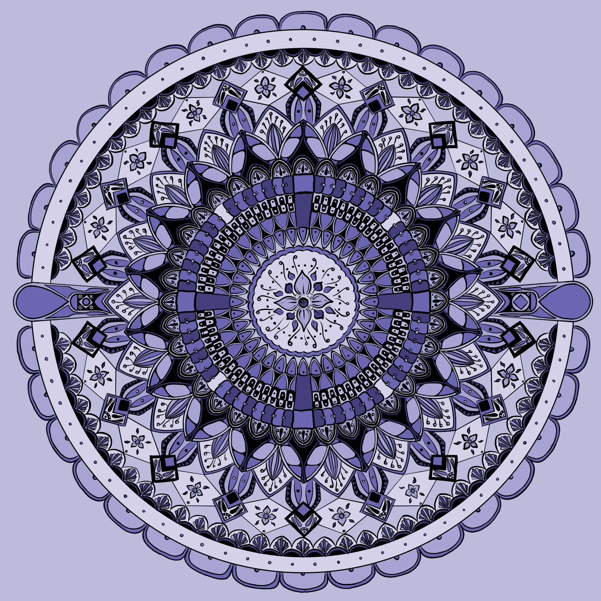

Bedtime drawing. An hour or so every night or so, for a few months. Helps me wind down from the day.

Usually that’s all it’s for, but my wife liked the finished product. So hey it’s on [Design by Hümans](https://www.designbyhumans.com/shop/pullover-hoodie/dream-aesthetic/1924278/) if you need a new sweatshirt or something! I did this in [Linea Sketch](https://linea-app.com/), which has a fixed canvas size. Better start using Procreate or Infinite Painter – and a larger canvas – just in case she wants the next one on a duvet.
